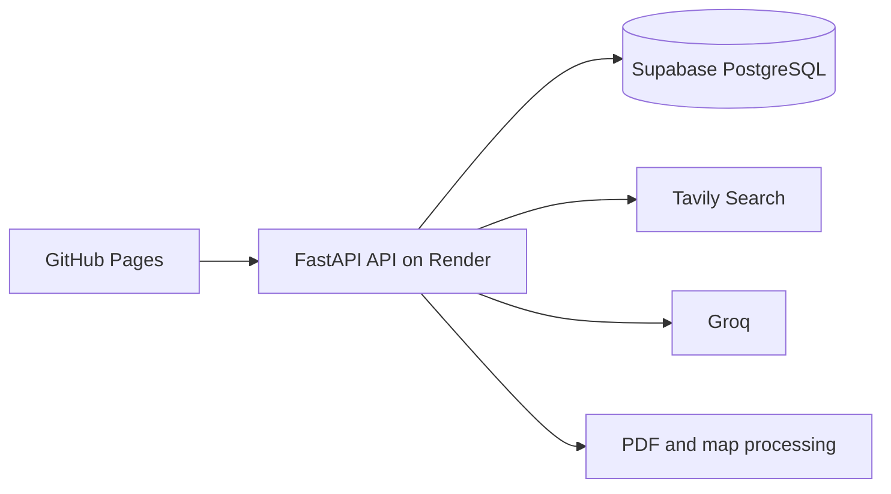

# Travel Planner

Travel planning application that combines destination research, structured travel guidance, maps, saved itineraries, and PDF export.

Live frontend: [jfor12.github.io/ai-travel-planner](https://jfor12.github.io/ai-travel-planner)

## Architecture



The frontend is a static single-page application hosted on GitHub Pages. The backend is a Dockerized FastAPI service hosted on Render's free web service. Supabase stores saved guides and provides the database-backed cache.

## Features

- Destination and month-specific travel guides
- Three focused Tavily searches combined with Groq responses, with the sources listed in each guide
- Cached guides to reduce repeated API usage (only the server writes to the cache)
- Rate limits: five new guides and 20 questions per hour per IP, plus overall hourly caps
- Interactive Leaflet maps, with places checked against OpenStreetMap (Nominatim)
- Shared saved itineraries backed by PostgreSQL
- PDF export with full Unicode text
- Follow-up questions about a generated guide

## Technology

- Python, FastAPI, Uvicorn, Pydantic
- LangChain, Groq, Tavily
- PostgreSQL with `psycopg`
- Vanilla JavaScript, HTML, CSS, Leaflet
- Docker and Render
- GitHub Pages

## Local Development

Install dependencies and start the API:

```bash
python -m venv .venv
source .venv/bin/activate
pip install -r requirements.txt
python -m uvicorn api:app --reload --port 8000
```

Create a `.env` file with:

```env
DATABASE_URL=your_supabase_connection_string
GROQ_API_KEY=your_groq_api_key
TAVILY_API_KEY=your_tavily_api_key
# Optional: use one exact model ID returned by Groq's /models endpoint.
GROQ_MODEL_ID=your_available_groq_model_id
```

Optional settings:

| Variable | Default | What it does |
|---|---|---|
| `ADMIN_TOKEN` | unset (admin endpoints off) | Secret for the admin endpoints below |
| `CACHE_MAX_AGE_DAYS` | `90` | Cached guides older than this are regenerated |
| `CLIENT_IP_HEADER` | unset | A header your proxy sets to the visitor's IP (for example `cf-connecting-ip`), used for rate limits |
| `FORWARDED_IP_INDEX` | `1` | Otherwise, which `X-Forwarded-For` entry is the visitor, counting from the right |
| `GEOCODER_URL` | Nominatim | Geocoding endpoint for map pins |

The API is available at `http://localhost:8000`. Open `index.html` directly for the frontend, or serve the repository with a local static file server.

## Deployment

### Backend on Render

The repository includes [render.yaml](render.yaml), which defines the free Docker web service. In Render:

1. Create a Blueprint and connect the GitHub repository.
2. Select the `main` branch.
3. Enter `DATABASE_URL`, `GROQ_API_KEY`, and `TAVILY_API_KEY` as secret environment variables. Optionally add `ADMIN_TOKEN` (a long random string) to enable the admin endpoints below.
4. Optionally set the single model setting, `GROQ_MODEL_ID`, to an exact model ID available to your Groq key. Remove any older model variables such as `GROQ_MODEL_NAME`, `GROQ_MODEL_INTEL`, or `GROQ_MODEL_CHAT`.
5. Apply the Blueprint and wait for the Docker deployment to finish.

Render supplies the `PORT` environment variable used by the Dockerfile. The free service may sleep when idle, so the first request after inactivity can be slow.

### Frontend on GitHub Pages

The production API URL is configured in `index.html`. Push changes to `main` and enable GitHub Pages from the repository's Pages settings using the root directory on the branch.

## API

| Endpoint | Body | Notes |
|---|---|---|
| `GET /health` | | |
| `POST /api/generate-intel` | `destination`, `month` | Served from the cache when possible; otherwise rate limited |
| `POST /api/chat` | `user_query` (max 500 chars) and either `trip_id` or `destination` + `month` | The guide is loaded on the server, never sent by the client |
| `POST /api/save-itinerary` | `destination`, `month` | Saves the server-generated guide to the shared trips |
| `POST /api/export-pdf` | `destination`, `month`, `guide_text` | |
| `GET /api/itineraries` | | Most recent 200 |
| `GET /api/itinerary/{trip_id}` | | |
| `PUT /api/itinerary/{trip_id}` | `guide_text` | Admin only |
| `DELETE /api/itinerary/{trip_id}` | | Admin only |
| `POST /api/init-db` | | Admin only |

Admin endpoints need the `X-Admin-Token` header to match the `ADMIN_TOKEN` environment variable, and are disabled when it isn't set. For example:

```bash
curl -X DELETE -H "X-Admin-Token: $ADMIN_TOKEN" https://ai-travel-planner-api-9d5f.onrender.com/api/itinerary/42
```

On Render, check which address the rate limits see by calling `GET /api/admin/request-info` with the admin token. If `rate_limit_key` is the same for different visitors, set `CLIENT_IP_HEADER` or `FORWARDED_IP_INDEX` to match the headers it shows.

The API creates any missing tables when it starts. `python init_db.py` does the same by hand.

### Moving guides from the old cache

Guides generated before `guide_cache` existed are stored in `saved_itineraries`. To reuse them instead of generating them again, run [scripts/import_old_cache.sql](scripts/import_old_cache.sql) in the Supabase SQL editor. It copies only rows that look clean (no HTML) and takes the oldest version of each guide.

## Tests

The tests run against a real PostgreSQL database. Use a throwaway one, never production:

```bash
pip install -r requirements-dev.txt
TEST_DATABASE_URL=postgresql://postgres@localhost:5432/postgres?sslmode=disable pytest
```

## Notes

Generated travel information can be inaccurate, outdated, or incomplete. Verify important details with official sources, local authorities, and current travel advisories.
