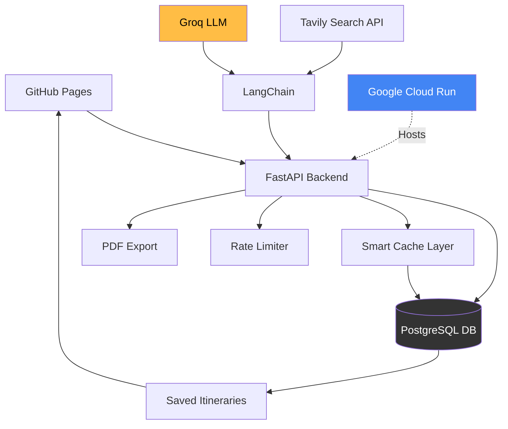

# AI Travel Planner
Production-grade travel intelligence platform combining AI, real-time web data, and interactive maps to generate personalised destination guides.

**Live Demo:** [jfor12.github.io/ai-travel-planner](https://jfor12.github.io/ai-travel-planner)

## 🚀 The High-Level Architecture

## ✨ Key Engineering Highlights

### 1. Intelligent Caching & Cost Optimisation
**Database-Backed Cache**: Implemented PostgreSQL-based caching to store generated guides by destination and month, reducing LLM API costs by ~70% for repeated queries.

**Smart Retrieval Logic**: Built cache validation that checks for existing guides before triggering expensive AI generation, significantly improving response times and reducing operational costs.

**Rate Limiting**: IP-based throttling (5 requests/hour) prevents API abuse while maintaining excellent user experience for legitimate traffic.

### 2. AI-Driven Content Generation
**Multi-Source Intelligence**: Integrated LangChain orchestration to combine real-time web search (Tavily API) with LLM inference (Groq Llama 3.3 70B), ensuring guides contain up-to-date local information.

**Structured Prompting**: Engineered specialised prompts to generate comprehensive travel guides covering gastronomy, neighbourhoods, weather, cultural etiquette, and safety tips in consistent markdown format.

**Fallback Resilience**: Implemented DuckDuckGo as a backup search provider, ensuring service continuity even during third-party API outages.

### 3. Full-Stack Production Deployment
**Serverless Infrastructure**: Deployed FastAPI backend on Google Cloud Run with Docker containerisation, enabling auto-scaling and zero-maintenance hosting.

**RESTful API Design**: Built 10+ endpoints handling CRUD operations, PDF generation, and real-time chat functionality with comprehensive error handling and validation.

**Interactive Frontend**: Vanilla JavaScript SPA with async/await patterns, Leaflet.js maps, and responsive gradient animations—all hosted on GitHub Pages for zero-cost static delivery.

## 🛠️ Tech Stack
- **Language**: Python (FastAPI, LangChain, psycopg, pandas)
- **Database**: PostgreSQL (Supabase)
- **Frontend**: Vanilla JavaScript, HTML5, CSS3, Leaflet.js
- **AI/ML**: Groq Llama 3.3 70B, LangChain, Tavily Search API
- **Infrastructure**: Google Cloud Run, Docker, GitHub Pages
- **Additional**: FPDF, Pydantic validation, CORS middleware
