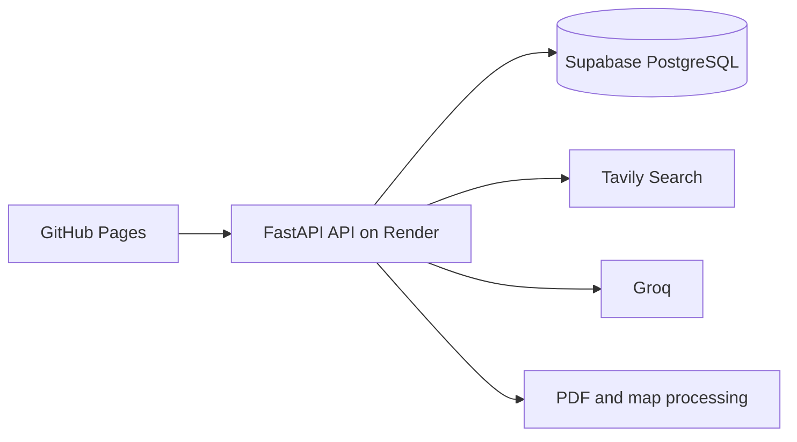

# Travel Planner

Travel planning application that combines destination research, structured travel guidance, maps, saved itineraries, and PDF export.

Live frontend: [jfor12.github.io/ai-travel-planner](https://jfor12.github.io/ai-travel-planner)

## Architecture



The frontend is a static single-page application hosted on GitHub Pages. The backend is a Dockerized FastAPI service hosted on Render's free web service. Supabase stores saved guides and provides the database-backed cache.

## Features

- Destination and month-specific travel guides
- Tavily research combined with Groq responses
- Cached guides to reduce repeated API usage
- IP-based limit of five new guide generations per hour
- Interactive Leaflet maps from extracted coordinates
- Shared saved itineraries backed by PostgreSQL
- PDF export
- Follow-up questions about a generated guide

## Technology

- Python, FastAPI, Uvicorn, Pydantic
- LangChain, Groq, Tavily
- PostgreSQL with `psycopg`
- Vanilla JavaScript, HTML, CSS, Leaflet
- Docker and Render
- GitHub Pages

## Local Development

Install dependencies and start the API:

```bash
python -m venv .venv
source .venv/bin/activate
pip install -r requirements.txt
python -m uvicorn api:app --reload --port 8000
```

Create a `.env` file with:

```env
DATABASE_URL=your_supabase_connection_string
GROQ_API_KEY=your_groq_api_key
TAVILY_API_KEY=your_tavily_api_key
# Optional: use one exact model ID returned by Groq's /models endpoint.
GROQ_MODEL_ID=your_available_groq_model_id
```

The API is available at `http://localhost:8000`. Open `index.html` directly for the frontend, or serve the repository with a local static file server.

## Deployment

### Backend on Render

The repository includes [render.yaml](render.yaml), which defines the free Docker web service. In Render:

1. Create a Blueprint and connect the GitHub repository.
2. Select the `main` branch.
3. Enter `DATABASE_URL`, `GROQ_API_KEY`, and `TAVILY_API_KEY` as secret environment variables.
4. Optionally set the single model setting, `GROQ_MODEL_ID`, to an exact model ID available to your Groq key. Remove any older model variables such as `GROQ_MODEL_NAME`, `GROQ_MODEL_INTEL`, or `GROQ_MODEL_CHAT`.
5. Apply the Blueprint and wait for the Docker deployment to finish.

Render supplies the `PORT` environment variable used by the Dockerfile. The free service may sleep when idle, so the first request after inactivity can be slow.

### Frontend on GitHub Pages

The production API URL is configured in `index.html`. Push changes to `main` and enable GitHub Pages from the repository's Pages settings using the root directory on the branch.

## API

- `GET /health`
- `POST /api/generate-intel`
- `POST /api/chat`
- `POST /api/save-itinerary`
- `POST /api/export-pdf`
- `GET /api/itineraries`
- `GET /api/itinerary/{trip_id}`
- `PUT /api/itinerary/{trip_id}`
- `DELETE /api/itinerary/{trip_id}`

Run `python init_db.py` once with `DATABASE_URL` configured, or call `POST /api/init-db`, to create the required tables.

## Notes

Generated travel information can be inaccurate, outdated, or incomplete. Verify important details with official sources, local authorities, and current travel advisories.
